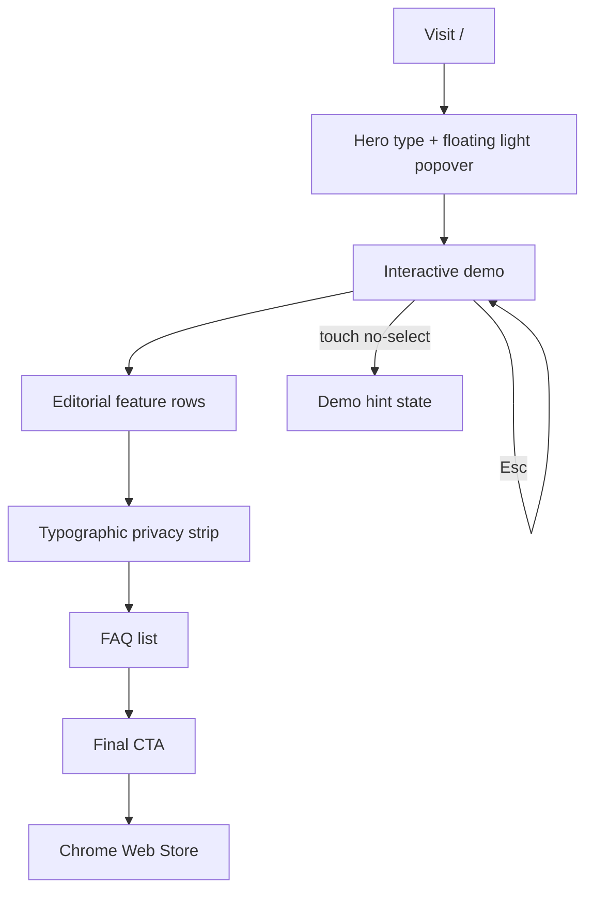

## Intake decisions (CEO review)

CEO already locked: white editorial Apple-style, no card-grid, no textures/gifs/generated images/gradients, SF Pro system stack, Blue-600 CTA, light tokens from the extension. Remaining decisions locked here with one-line rationale:

1. **Radius** — 8px controls (`rounded.md`), 12px nested surfaces (`rounded.lg`, matches extension `--radius`), 16px product mockup (`rounded.xl`), 4px keycaps, pills 9999px. Apple HIG + concentric rule `inner = outer − padding`.
2. **Density** — Spacious-editorial: `{spacing.section}` 140px desktop (112px tablet, 80px mobile), 24px container padding, 80px internal row gaps. Whitespace is the separator.
3. **Icons** — Lucide, 1.5px stroke, 16–20px optical size. Matches SF Symbols light/regular, already in the repo.
4. **Data-as-design** — (a) live quota chip `10 requests / 2 hours` inside the mockup; (b) SF Mono keycaps `⌘C` `⌥C` `⏎` `Esc`. No extra charts.
5. **Depth** — One floating-shadow exception on the product mockup: `{colors.mockup-shadow}`. Zero box-shadow on nav, buttons, features, FAQ, footer. Nav may use `backdrop-filter: blur(16px)` as the single glass surface.

## Overview

White editorial Apple-style marketing page for **AI Clipboard — Copy & Understand**. The canvas is pure `{colors.canvas}` `#FFFFFF`. Type, the floating product, and restrained motion do all the work.

Philosophy: content floats on whitespace. No card-grid sections. No hairline-border-everywhere. Max **two** bordered surfaces on the whole page: (1) the hero product mockup, (2) the interactive demo stage. Everything else is type + space.

Brand mood: quiet, precise, macOS Look Up. Density: spacious. Conversion: a single Blue-600 `#2563EB` pill per fold ("Add to Chrome").

### Anti-slop rules (hard)

1. **No gradients** — no stripe band, no keycap metallic shine beyond a 1-stop fill, no aurora, no blobs.
2. **No textures, gifs, generated images, stock photos.**
3. **No card-grid / bento.** Features are editorial rows (text | visual, then visual | text).
4. **No Geist.** Font stack is SF Pro system only.
5. **No purple / beige.**
6. **No decorative motion.** Motion reveals content. Max 400ms. Product-surface tilt is the only parallax.
7. **Eyebrow restraint:** max one small-caps `{typography.label-caps}` eyebrow per three sections. Hero may use one ("Cloudflare Workers AI · Llama 3.3 70B"). Features get none.
8. **Copy is verbatim** from `research/marketing-copy.md`. Do not rewrite headlines, bodies, FAQ, or CTAs.

### Engineer mapping (one pass, no new deps)

Existing `framer-motion` only. Files to restyle, not invent:

| File | Change |
|---|---|
| `clipboard-web/src/app/layout.tsx` | Remove `Geist` / `Geist_Mono` imports. Body font = system SF Pro stack. Mono = `ui-monospace, "SF Mono", Menlo, Monaco, Consolas, monospace`. |
| `clipboard-web/src/app/globals.css` | Replace dark tokens with the YAML colors. `color-scheme: light`. `--section-y: 140px`. Focus ring on white. |
| `clipboard-web/tailwind.config.ts` | Sans/mono stacks; `boxShadow.popover` = `{colors.mockup-shadow}`; drop dark stripe vars. |
| `clipboard-web/src/components/header.tsx` | Minimal sticky nav; blur on scroll; drop version-badge chrome if it adds a bordered pill. |
| `clipboard-web/src/components/hero.tsx` | Delete diagonal stripe. Huge regular-weight H1. Whitespace. CTAs. Mockup below. |
| `clipboard-web/src/components/hero-mockup.tsx` | Drop faux browser-window chrome. The popover itself floats on white with `{colors.mockup-shadow}`, restyled to real light card (`result-popover.tsx`: `bg-white border-slate-200 rounded-xl`). Quota chip stays. Optional: one highlighted sentence above the card, unboxed. |
| `clipboard-web/src/components/demo.tsx` + `demo-stage.tsx` | Keep interaction. Restyle to light. Demo stage is bordered surface #2. |
| `clipboard-web/src/components/bento-grid.tsx` + `bento-card.tsx` | Replace grid with five full-width editorial rows (alternate text/visual). Rename conceptually; file names may stay if cheaper. **No card wrappers, no `border-hairline` on the row.** |
| `clipboard-web/src/components/privacy.tsx` | Typographic strip. No boxes, no bordered columns. Three blocks of type separated by space or a single vertical rhythm. |
| `clipboard-web/src/components/faq.tsx` | Keep accordion. Hairline row dividers only. No outer card. |
| `clipboard-web/src/components/final-cta.tsx` | Centered re-hook + one blue pill. Footer = type + one top hairline. |
| `clipboard-web/src/components/keycap.tsx` | Light fill `{colors.key-bg-start}` / `{colors.key-bg-end}`, hairline `{colors.hairline}`, ink `{colors.body}`. |

---

## UX Flow & Information Architecture

### Personas

- **Researcher / student** — arXiv, docs, papers. Wants Look Up without leaving the page.
- **Engineer** — RFCs, API refs. Wants `⌥C`, copy-capture, local API keys.

### Entry / exit

- **Enter:** `/` (clipboard-web). Store CTA currently `#` (CWS not live). GitHub secondary: `https://github.com/pantorn/AI-Clipboard-extension`.
- **Exit:** Chrome Web Store (primary), GitHub, `/privacy`.

### Journeys (product, mirrored on the page)

1. Select text → pill → Explain → inline popover (Llama 3.3 70B).
2. `⌘C` → copy toast → Explain / Summarize.
3. `⌥C` / `Alt+C` → side panel chat.
4. Options → BYO key in `chrome.storage.local` (unlimited) vs free 10 req / 2 h.



### State table

| State | Hero mockup | Demo playground | Feature rows | FAQ | Nav |
|---|---|---|---|---|---|
| **Default** | Popover open, explanation + quota chip `10 requests / 2 hours` | Unselected sample text; caption visible | Type + product fragment, no cards | Collapsed rows, hairline dividers | Transparent; no blur |
| **Hover** | Footer ghost buttons bg `{colors.surface-elevated}` | Pill buttons scale 1.02 / 150ms | Visual fragment scale 1.02 if clickable | Question color stays `{colors.ink}` | Link color `{colors.ink}` |
| **Focus** | Ring `0 0 0 2px #FFFFFF, 0 0 0 4px #2563EB` | Same ring | Same ring | Same ring | Same ring |
| **Pressed** | CTA scale 0.98, 150ms | Same | Same | Chevron rotates 180°, 200ms | CTA scale 0.98 |
| **Loading** | N/A (static art) | 700ms mock stream; 3-line skeleton in result body | N/A | N/A | N/A |
| **Empty** | N/A | Hint: "Select text above to trigger inline Look Up." | N/A | N/A | N/A |
| **Error** | Quota chip amber if shown exhausted | Result card `{colors.accent-red}` text + Retry | N/A | N/A | N/A |
| **Success** | Copy control → Check + "Copied" 2s | Same | N/A | Answer expands 200ms ease-out | N/A |
| **Permission / touch fail** | N/A | **See domain invariant** | N/A | N/A | N/A |
| **Scrolled** | Subtle tilt on mockup only | Sticky? no | — | — | `bg-white/80 backdrop-blur-md`; 1px `{colors.hairline}` bottom |

### Domain invariant (missing state — do not "fix" in this spec beyond naming it)

**Missing state:** Interactive demo on touch / iOS, when `window.getSelection()` never yields a range (native callout steals the gesture). User taps the sample, sees no pill, and the playground looks broken.

**Impact:** User sees a dead demo when the landing promised "Select text… explanation appears in place," because no fallback "Tap Explain to preview" control exists.

**For implementers:** keep the current desktop selection demo; add a persistent text button pair (Explain / Summarize) under the sample on viewports that cannot select, so the flow still plays. This is the one gap — do not invent other states.

---

## Colors

Extension light theme (`clipboard-extension/src/style.css` `:root`) remapped. CTA is Blue-600 per product button, not the extension's Blue-500 token.

| Token | Hex | Role | Contrast on `#FFFFFF` |
|---|---|---|---|
| `{colors.canvas}` | `#FFFFFF` | Page background | — |
| `{colors.ink}` | `#0F172A` | Headlines, primary text (slate-900) | ~16:1 AAA |
| `{colors.body}` | `#334155` | Paragraphs (slate-700) | ~8.1:1 AAA |
| `{colors.charcoal}` / `{colors.mute}` | `#64748B` | Secondary, captions, nav, FAQ closed (slate-500) | ~4.6:1 AA |
| `{colors.ash}` | `#94A3B8` | Disabled / decorative only — **not body text** | fail AA |
| `{colors.hairline}` | `#E2E8F0` | The two allowed surfaces + FAQ / footer rules (slate-200) | — |
| `{colors.surface-elevated}` | `#F8FAFC` | Mockup header, keycap shade, quota chip | — |
| `{colors.primary}` | `#2563EB` | CTA fill | white on blue ~4.6:1 AA |
| `{colors.primary-hover}` | `#1D4ED8` | CTA hover | — |
| `{colors.primary-pressed}` | `#1E40AF` | CTA pressed | — |
| `{colors.on-primary}` | `#FFFFFF` | CTA label | — |
| `{colors.accent-green}` | `#059669` | Copied check (darker than 500 so it holds AA on white) | ~4.5:1 |
| `{colors.accent-amber}` | `#D97706` | Quota warning | ~3.4:1 — use only at 14px+ bold or on chip |
| `{colors.accent-red}` | `#DC2626` | Error text | ~4.5:1 |

No dark-mode variant on this page (`color-scheme: light` only). Do not ship a `.dark` block for the landing.

---

## Typography

System stack, no webfont request (drops Geist, zero new deps):

```
--font-sans: -apple-system, BlinkMacSystemFont, "SF Pro Display", "SF Pro Text", "Segoe UI", system-ui, sans-serif;
--font-mono: ui-monospace, "SF Mono", SFMono-Regular, Menlo, Monaco, Consolas, monospace;
```

Apple weight contrast: **display = regular (400) + tight tracking**; **labels = medium (500) + wide tracking**.

| Token | Size / breakpoints | Weight | Tracking | Use |
|---|---|---|---|---|
| `display-xl` | 40px → 56px (md) → 72px (lg) | 400 | -0.04em | Single H1 |
| `display-lg` | 32px → 40px → 48px | 400 | -0.03em | Final CTA H2, FAQ H2 |
| `heading-xl` | 24px → 28px | 600 | -0.02em | Feature row titles |
| `heading-md` | 21px | 600 | -0.01em | Privacy titles |
| `body-lg` | 19px → 21px | 400 | 0.01em | Hero subhead, feature bodies |
| `body-md` | 17px | 400 | 0 | FAQ answers, demo sample |
| `body-sm` | 15px | 400 | 0 | Nav links, footer |
| `label-caps` | 12px | 500 | 0.08em | One hero eyebrow max |
| `caption-sm` | 12px | 500 | 0.04em | Quota chip, microcopy |
| `caption-md` | 13px | 400 | 0.02em | Keycaps |
| `button-md` | 15px | 500 | -0.01em | CTAs |

`-webkit-font-smoothing: antialiased`. Tabular nums on quota (`font-variant-numeric: tabular-nums`).

---

## Layout

8px base. Spacious, not Raycast-compact.

- Container: max-width **980px** for type; mockup/demo may go **720–800px** centered. Horizontal padding 24px (16px <480).
- Section padding-y: 140px desktop / 112px tablet / 80px mobile (`{spacing.section}`).
- Feature row gap: 48–64px between text column and visual; 140px between rows.
- Do not switch background colors between sections. One white canvas the whole way.

Whitespace philosophy: if a section needs a box to exist, delete the box.

---

## Elevation & Depth

| Level | Treatment | Where |
|---|---|---|
| 0 | Flat white | Page, type, features, privacy, FAQ, CTA, footer |
| 1 | 1px `{colors.hairline}` only | FAQ row rules, footer top rule, demo stage |
| 2 | `{colors.mockup-shadow}` + 1px hairline + `{rounded.xl}` | **Hero product mockup only** |
| Glass | `backdrop-filter: blur(16px)` + `bg-white/80` | **Sticky nav after scroll only** (1 glass surface max) |

Banned: `shadow-md/lg/xl/2xl` on anything else, glow, ring-offset shadows as decoration.

---

## Shapes

Apple nested-surface rule: `inner_radius = outer_radius − padding` (min 4px).

| Token | px | Use |
|---|---|---|
| `none` | 0 | Nav, footer, page |
| `xs` | 4 | Keycaps, quota chip |
| `sm` | 6 | Mockup inner buttons (`16 − 10`) |
| `md` | 8 | Controls inside mockup |
| `lg` | 12 | Demo stage (extension `--radius`) |
| `xl` | 16 | Product mockup card |
| `full` | 9999 | Primary/secondary CTA, selection pill |

Never 24px+ radii. Never sharp 0 on the mockup.

---

## Components

All states: default, hover, pressed, focus, loading, empty, error, success.

### Primary button

- Default: `{colors.primary}` fill, `{colors.on-primary}` text, h-44, px-22, `{rounded.full}`, `{typography.button-md}`. Icon Lucide `Download` 16px, stroke 1.5.
- Hover: `{colors.primary-hover}`, scale 1.02, 150ms ease-out.
- Pressed: `{colors.primary-pressed}`, scale 0.98.
- Focus: `0 0 0 2px #FFFFFF, 0 0 0 4px #2563EB`.
- Loading: keep width, swap icon for 16px spinner (CSS border, not a new lib), `aria-busy`.
- Disabled: `{colors.surface-card}` / `{colors.ash}`, no pointer.
- Rule: **one** solid blue pill per fold.

### Secondary button

Transparent, no border (border would add a third "surface"). Text `{colors.ink}`. Hover: `{colors.surface-elevated}` fill. Same height/radius as primary.

### Keycap

h-20, `{rounded.xs}`, 1px `{colors.hairline}`, fill `{colors.key-bg-start}`, text `{colors.body}`, `{typography.caption-md}`. No gradient animation. Examples: `⌘C`, `⌥C`, `⏎`, `Esc`, `⌘,`.

### Quota chip (`quota-chip`)

Inside mockup body. `{typography.caption-sm}` `{colors.charcoal}` on `{colors.surface-elevated}`, `{rounded.xs}`. Copy: `10 requests / 2 hours`. Exhausted variant: `{colors.accent-amber}` text + "BYO key `{keycap}⌘,`".

### Product mockup (`command-palette-card`)

Replica of `result-popover.tsx` light mode:

- 360–380px wide, `{rounded.xl}`, bg `#FFFFFF`, border 1px `{colors.hairline}`, shadow `{colors.mockup-shadow}`.
- Header 38px, px-14, bottom hairline. Lucide Sparkles 16px `{colors.charcoal}` + "Explain" `{typography.body-sm-strong}`. Close X 16px.
- Body px-14 py-14, `{typography.body-sm}` `{colors.body}`. Quota chip + optional latency `280ms · Llama 3.3 70B` in `{typography.caption-sm}`.
- Footer 44px, top hairline. Ghost Copy / Open in chat + `{keycap}⌥C`.
- Loading (demo only): 3 skeleton lines, 700ms, then text.
- Error: `{colors.accent-red}` sentence + Retry.
- Empty: do not show an empty card; hide until result.

### Selection pill (demo + mockup)

`{rounded.full}`, bg white, 1px `{colors.hairline}`, `{colors.mockup-shadow}` **only if it is the hero mockup pill**; in the demo, same as mockup but no second page-level shadow if the demo stage already has a border. Items: Explain (Sparkles), Summarize (FileText), Copy. 14px icons, stroke 1.5.

### Accordion (FAQ)

No card. Item = hairline bottom `{colors.hairline}`. Trigger py-20, `{typography.heading-sm}` `{colors.ink}`, chevron `{colors.charcoal}`. Content `{typography.body-md}` `{colors.body}` pb-20. Expand 200ms ease-out. Hover: no fill.

---

## Do's and Don'ts

### Do

- White `#FFFFFF` canvas, SF Pro system stack, Blue-600 CTA.
- Huge regular-weight display type, tight tracking.
- Float the real light popover on white with the one allowed shadow.
- Editorial feature rows; privacy as type; FAQ as a list.
- Scroll reveals 300ms ease-out, 60–80ms stagger.
- Keep marketing copy verbatim.

### Don't

- Don't ship Geist, Inter, or any webfont.
- Don't ship a bento / card grid / "feature-card-dark".
- Don't ship the blue diagonal stripe or any gradient background.
- Don't hairline-border every section.
- Don't use slate-400 `#94A3B8` for paragraph text (AA fail on white).
- Don't add images, lottie, particles, count-ups, or auto carousels.
- Don't rewrite copy.

---

## Page Layout & Component Grid

```
[NAV] wordmark                    Features  Demo  Privacy  FAQ     [Add to Chrome]
                                 (blur after scroll; 1 glass)

[HERO]  (min-height ~ 100vh minus nav)
        optional label-caps eyebrow: Cloudflare Workers AI · Llama 3.3 70B
        H1 72/400/-0.04em: Understand anything faster than ever.
        body-lg charcoal: Copy text, get instant summaries, or ask follow-ups
                          in a side panel. Zero tab-switching.
        [Add to Chrome]  [View on GitHub]
        caption-sm: Free tier includes 10 requests every 2 hours. No credit card required.
        (80px space)
        FLOATING LIGHT POPOVER  (surface #1) + quota chip
        optional unboxed highlighted sentence above it

[DEMO]  body-lg caption: Select text or press Cmd+C anywhere. The explanation appears in place.
        light demo stage (surface #2)

[FEATURES]  five editorial rows, alternating, no cards
        1 text L / toast visual R     Smart Clipboard History
        2 popover visual L / text R   macOS Look Up Everywhere
        3 text L / sidepanel visual R Deep Dive Side Panel
        4 lock glyph L / text R       Private by Architecture
        5 text centered + keycaps     Instant Zero-Setup Use

[PRIVACY]  three typographic columns, no boxes

[FAQ]  H2 Frequently Asked Questions (if needed) + 5 hairline rows

[CTA]  H2: Stop switching tabs to explain text.
       [Add to Chrome — It's Free]

[FOOTER]  one top hairline · 6 links · wordmark · © 2026 · MIT · Chrome MV3
```

### Nav (`header.tsx`)

Height 52px. Default: `bg-transparent`. Scrolled: `bg-white/80 backdrop-blur-md` + bottom 1px `{colors.hairline}`. Left: `/icon.png` 24px `{rounded.md}` + "AI Clipboard" `{typography.body-sm-strong}`. Center (md+): Features, Demo, Privacy (was "Architecture" — keep hash `#privacy`), FAQ. Right: GitHub icon (no bordered box; 44px hit) + primary "Add to Chrome". Mobile: hide links, keep wordmark + CTA. No hamburger unless links cannot fit — prefer hide.

### Hero (`hero.tsx` + `hero-mockup.tsx`)

Copy verbatim:

- H1: Understand anything faster than ever.
- Sub: Copy text, get instant summaries, or ask follow-ups in a side panel. Zero tab-switching.
- Primary: Add to Chrome → `#`
- Secondary: View on GitHub → repo URL
- Micro: Free tier includes 10 requests every 2 hours. No credit card required.

H1 is the page's only `<h1>`. Max-width 720px, centered. Mockup centered, not inside a browser frame.

### Demo (`demo.tsx`)

Caption verbatim: Select text or press Cmd+C anywhere. The explanation appears in place.

Stage: `{rounded.lg}`, 1px `{colors.hairline}`, bg white, padding 32–40px. Keep selection → pill → mock stream → result. Esc resets. Empty hint as in state table. Touch fallback: Explain / Summarize text buttons.

### Features (replace bento)

Copy verbatim per block:

1. **Smart Clipboard History** — Recalls recent clips automatically. Run one-click explain or summarize actions directly from the copy toast. Visual: copy-toast fragment (Captured + Explain / Summarize), unboxed.
2. **macOS Look Up Everywhere** — Highlights trigger a lightweight floating card right next to your selection. Read the takeaway without losing your place. Visual: mini popover + `{keycap}⏎`.
3. **Deep Dive Side Panel** — Hit Alt+C to slide out a persistent chat. Ask follow-up questions about selected text without leaving your active tab. Visual: two chat bubbles + `{keycap}⌥C`.
4. **Private by Architecture** — Custom API keys never leave local browser storage. Free tier requests run ephemerally on Cloudflare Workers AI. Visual: Lucide `Lock` 20px + `chrome.storage.local` in mono. No shield-card.
5. **Instant Zero-Setup Use** — Install and run immediately. No account signup, no API key required to start, and sub-second responses. Visual: `{keycap}` cluster, no latency-badge card.

Row structure: 12-col, 5+7 or 7+5, align-center, py from section rhythm. Title `{typography.heading-xl}`, body `{typography.body-lg}` `{colors.body}`.

### Privacy (`privacy.tsx`)

No boxes. Optional one `{typography.label-caps}` eyebrow "Privacy" (counts toward the 1-per-3 quota; skip if hero already used one). Three columns (stack on mobile):

1. **Zero background surveillance** — AI Clipboard activates only when you select text or trigger an explicit action—it never logs unselected browsing.
2. **Local key isolation** — If you bring your own OpenAI or Anthropic API key, it stays strictly in local browser storage (`chrome.storage.local`).
3. **No training on your data** — Free-tier queries route ephemerally through Cloudflare Workers AI and are discarded immediately after inference.

Titles `{typography.heading-md}`; bodies `{typography.body-sm}` `{colors.body}`. Icons optional, 20px, `{colors.charcoal}`, not in tiles.

### FAQ (`faq.tsx`)

Questions/answers verbatim from marketing-copy.md (Q1–Q5). Centered max-width 720px. Hairline dividers only.

### Final CTA + footer (`final-cta.tsx`)

Re-hook: Stop switching tabs to explain text.
Button: Add to Chrome — It's Free.

Footer links: Product, Extension Features, Privacy Policy, GitHub Repository, Cloudflare Workers AI, Chrome Web Store. Bottom: AI Clipboard · © 2026 AI Clipboard • MIT License • Built for Chrome MV3.

---

## Responsive & Platform Matrix

Breakpoints: 480 / 768 / 1024 / 1280. Touch targets ≥44px. Focus visible always. `prefers-reduced-motion` kills all motion.

| Section | Mobile <480 | Tablet 480–768 | Desktop 769–1280 | Platform | Verification |
|---|---|---|---|---|---|
| Nav | Wordmark + CTA 44px. Links hidden. | Wordmark + CTA + GitHub. | Full links. | `position: sticky/fixed`; blur only after `scrollY > 8`. | No overlap with H1. |
| Hero | H1 40px/400. CTAs stack 100% width, 44px. Mockup 100% width, shadow preserved. | H1 56px. CTAs row. Mockup 90%. | H1 72px. Mockup 380px card. | No stripe. No window chrome. | Single h1. Contrast ink/white. |
| Demo | Short sample. Pill below text. Touch fallback buttons visible. | Standard. | Full stage ~720px. | Selection + keyboard Esc. | Empty hint if idle. |
| Features | Stack visual under title/body. 80px row gap. | Alternate still; visual 40% width. | Alternate L/R, 140px row gap. | No card class. | No `border` on row wrapper. |
| Privacy | Stack 3 blocks, 32px gap. | 3-col. | 3-col, 40px gap. | No boxes. | |
| FAQ | Full width, 48px trigger. | max 680. | max 720. | Tab / Space / Enter. | |
| CTA | H2 32px. Full-width pill. | H2 40px. | H2 48px. | One blue pill. | |
| Footer | 2-col links. | 3-col. | 6-col. | Top hairline only. | |

Overflow: `overflow-x: hidden` on body. Mockup must not cause horizontal scroll.

---

## Navigation Decision

**Sticky top navbar + persistent primary CTA.** No sidebar. No hover-expand. Mobile: hide secondary links rather than a hamburger drawer (one conversion action). Hash targets: `#features` `#demo` `#privacy` `#faq`.

---

## Motion & Interaction

Library: existing `framer-motion`. Wrap page in `MotionConfig reducedMotion="user"` (already in `page.tsx`).

Allowed:

| Name | Value | Where |
|---|---|---|
| Scroll reveal | `opacity 0→1`, `y 16→0`, **300ms**, `ease: [0.16, 1, 0.3, 1]` (ease-out) | Hero type, each feature row, privacy, FAQ, CTA |
| Stagger | **60–80ms** between sibling reveals | Hero cluster (eyebrow, h1, sub, actions, mockup); feature rows |
| Hover scale | `scale 1.02`, 150ms ease-out | Buttons, clickable pill items |
| Press | `scale 0.98`, 150ms | Buttons |
| Accordion | height auto, 200ms ease-out | FAQ |
| Mockup enter | same 300ms fade+rise | Hero mockup |
| Mockup tilt | scroll-linked `rotateX(0→4deg)` / `translateY` parallax, **product surface only**, max 8px | Hero mockup. Use `useScroll` + `useTransform`. Disabled if reduced motion. |
| Demo result | 200ms fade-in | Result card |

Banned: springs as default page motion, 0ms Raycast keyboard theatre on marketing type, stripe, particles, count-up, shimmer longer than the 700ms demo load, parallax on headlines, bounce, loops >400ms except the 700ms demo skeleton.

```css
@media (prefers-reduced-motion: reduce) {
  *, *::before, *::after {
    animation-duration: 0.01ms !important;
    animation-iteration-count: 1 !important;
    transition-duration: 0.01ms !important;
    scroll-behavior: auto !important;
  }
}
```

Tilt/parallax must be gated on `useReducedMotion() === false`.

---

## Visual Asset Plan

- Brand: `/icon.png` (24 / 32). No new assets.
- Simple Icons GitHub SVG inline (already in header). Chrome logo only if needed; not required.
- Lucide (existing): Sparkles, FileText, Copy, Check, Download, Lock, ChevronDown, X, MessagesSquare. Stroke 1.5.
- Zero photos, zero OG generation in this pass, zero Lottie.

SEO (already in layout, keep):

- Title: AI Clipboard — Copy & Understand for Chrome
- Meta: Instant AI explanations and summaries on any webpage with macOS-style Look Up, clipboard history, and a side panel. Free, private, and fast.
- OG: Instant AI explanations and summaries on any webpage without switching tabs.
- H1: Understand anything faster than ever.

---

## Post-Build Critique Checklist

- [ ] Canvas `#FFFFFF`. No dark leftover (`#020617` gone).
- [ ] No Geist in `layout.tsx` or computed font-family.
- [ ] No diagonal stripe, no gradient backgrounds.
- [ ] No bento / feature cards with borders. Features are rows.
- [ ] Privacy has no boxed columns.
- [ ] At most two bordered surfaces: mockup + demo stage.
- [ ] Mockup is the light `bg-white border-slate-200` popover with `{colors.mockup-shadow}`.
- [ ] Quota chip visible: `10 requests / 2 hours`.
- [ ] Keycaps SF Mono stack.
- [ ] Display H1 weight 400, tracking -0.04em.
- [ ] One H1. One blue pill per fold.
- [ ] Section y ≈ 140px desktop.
- [ ] Scroll reveals 300ms; reduced-motion collapses.
- [ ] Copy matches `research/marketing-copy.md` verbatim.
- [ ] Focus rings on white. Touch 44px. AA on all text vs white (no slate-400 body).
- [ ] No new npm deps.

---

## Accessibility

- Single `h1`. Feature titles `h2`. Privacy titles `h3`. FAQ questions are buttons inside `h2` or `h3` via the accordion trigger — do not add a second page h1.
- `lang="en"`. Skip link optional but recommended: "Skip to demo".
- Contrast: ink/body/charcoal vs white as tabled. Primary button white on `#2563EB` ~4.6:1.
- Focus: never `outline: none` without the 2px canvas + 4px `#2563EB` ring.
- Demo: `role="region"` `aria-label="Interactive demo"`. Result `role="status"` for the mock stream. Esc documented in a visually adjacent hint.
- Motion: `MotionConfig reducedMotion="user"` + CSS kill-switch.
- Images: icon `alt=""`. Mockup `role="img"` `aria-label="AI Clipboard popover explaining selected text"`.

Do not commit. Only overwrite the spec file.