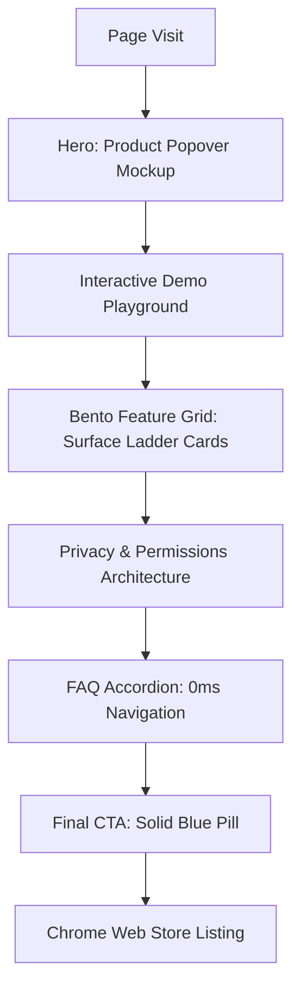

## Overview

This specification establishes the official user interface and visual design system for the **AI Clipboard** Chrome extension landing page (`AI-Clipboard-extension`). Following the rejection of generic AI templates ("AI slop"), this document translates **Raycast's actual design system** onto the extension's **slate+blue color palette**, Geist typography, and in-product popover mechanics.

The marketing page is treated as an **extended, high-fidelity product screenshot**. The canvas is dark-only (`{colors.canvas}` — `#020617`), elevation is achieved strictly through an achromatic 4-step surface ladder (`#020617` → `#0F172A` → `#1E293B` → `#283548`) bounded by hairline 1px borders (`{colors.hairline}` — `#303B4E`), and all primary calls-to-action use the extension's solid Blue-600 pill (`{colors.primary}` — `#2563EB`).

### Anti-Slop Architectural Rules
1. **No Drop Shadows**: Drop shadows, blur halos, and fuzzy elevations are completely eliminated. Depth is communicated solely through surface brightness and crisp 1px borders.
2. **No Aurora / Gradient Glow Blobs**: Radial background blobs, colored blur meshes, and purple/fuchsia light leaks are strictly banned.
3. **No Glassmorphism Cards**: Card bodies use opaque dark surfaces (`#0F172A` or `#1E293B`). Background blur is restricted to the sticky navigation header over scrollable content.
4. **Accents Inside Illustrations Only**: Chromatic colors (Blue `#3B82F6`, Green `#10B981`, Amber `#F59E0B`, Red `#EF4444`) are strictly forbidden on site chrome or card backgrounds; they appear exclusively inside UI mockups, status badges, and syntax highlights.
5. **Signature Stripe Moment**: A single diagonal 3-stripe gradient band in the blue family (`{colors.hero-stripe-start}` `#2563EB` → `{colors.hero-stripe-end}` `#1E3A8A`) is placed across the very top of the hero viewport. It appears **exactly once per page** and never recurs down the page.
6. **Physical Keycap Glyphs**: Keyboard shortcuts use physical-feel linear gradient keycaps (`{component.keycap}`) with Geist Mono glyphs (`⌘ C`, `⌥ C`, `⏎`, `Esc`).

---

## UX Flow & Information Architecture

### Target Personas
- **The Research Scientist / Student**: Reads arXiv PDFs, technical docs, and academic literature. Needs instant explanations of mathematical concepts or unfamiliar acronyms without switching tabs or losing reading place.
- **The Senior Software Engineer**: Reads complex library documentation, RFCs, and API references. Wants keyboard-driven shortcuts (`⌥ C`), copy capture, and local API key privacy.

### Primary User Journeys
1. **Instant Inline Look Up**: Text selection on any web page → floating action pill appears → click "Explain" → instant in-place response card appears via Cloudflare Workers AI + Llama 3.3 70B.
2. **Copy Capture Flow**: Press `⌘ C` / `Ctrl+C` to copy code or text → unobtrusive toast notifies capture → instant Explain / Summarize action available directly from the toast.
3. **Persistent Deep Dive**: Press `⌥ C` (or `Alt+C`) → slide-out side panel opens with full context history for multi-turn Q&A.
4. **BYO Key Privacy**: Open extension options → toggle from Free Tier (10 req/2h) to BYO Key mode → paste OpenAI / Anthropic key into encrypted local storage (`chrome.storage.local`).

### Domain Invariant & State Table



| State | Hero Popover | Interactive Demo | Feature Grid | FAQ Accordion |
|---|---|---|---|---|
| **Default / Idle** | Popover open with generated explanation & action buttons | Unselected sample text with floating pill hint | 5 bento cards with alternating surface ladder | Collapsed accordion rows with 1px hairlines |
| **Active / Focused** | Highlighted active action button (`#1E293B`) | Live text selected, instant pill popup anchored to selection | Hover border brightens to `{colors.hairline-strong}` (0ms) | Expanded panel with 130ms ease-out enter |
| **Loading / Streaming** | Border shimmer (1000ms linear) + spinner badge in footer | Shimmer pulse over result container during mock fetch | N/A | N/A |
| **Empty / Reset** | N/A | "Select text above to trigger inline Look Up" prompt | N/A | N/A |
| **Error / Quota Edge** | Red soft badge (`#EF4444`) with "Retry" action | Error toast simulator if offline | N/A | N/A |

> **Domain Invariant Finding (Mandatory Check)**:
> **"What UI state is missing?"**
> **Missing State:** Quota Exhaustion / Rate Limit Warning State in the Hero Demo Mockup.
> **Impact:** When a user exhausts the free tier (10 requests / 2 hours), they see an error toast when they expect an explanation because no inline quota replenishment / BYO key transition prompt is designed inside the popover preview.
> **Spec Resolution:** The hero mockup and demo component must explicitly render the quota status indicator (`10/10 free queries remaining`) with a direct link/keycap hint to `Settings [⌘ ,]` for BYO key entry.

---

## Colors

The color palette remaps Raycast's structure onto AI Clipboard's slate and blue theme.

### Brand & Interactive Action
- **Primary Blue** (`{colors.primary}` — `#2563EB`): The universal primary action color. Used for the single "Add to Chrome" pill per fold, the primary nav CTA, and the final CTA.
- **Primary Hover** (`{colors.primary-hover}` — `#4F46E5`): Interactive hover state (Indigo-600) for primary buttons.
- **Primary Pressed** (`{colors.primary-pressed}` — `#1D4ED8`): Active/pressed state (Blue-700).
- **On Primary** (`{colors.on-primary}` — `#FFFFFF`): Pure crisp white text on primary buttons (contrast ratio > 7.0:1, WCAG AAA).

### Surface Ladder (Achromatic Elevation)
- **Canvas** (`{colors.canvas}` — `#020617`): Deep slate-950 page background. The foundational surface of the entire viewport.
- **Surface** (`{colors.surface}` — `#0F172A`): Slate-900. First elevation step for standard feature cards, interactive demo playground, and primary nav.
- **Surface Elevated** (`{colors.surface-elevated}` — `#1E293B`): Slate-800. Second elevation step for alternating bento cards, secondary buttons, inputs, and active pill tabs.
- **Surface Card** (`{colors.surface-card}` — `#283548`): Third elevation step for command palette row selection, icon tiles, and keycaps.
- **Button FG** (`{colors.button-fg}` — `#1E293B`): In-card button fill container.
- **Hairline** (`{colors.hairline}` — `#303B4E`): Universal 1px border on all cards, nav dividers, and containers.
- **Hairline Soft** (`{colors.hairline-soft}` — `rgba(255,255,255,0.08)`): Translucent inner divider on popovers.
- **Hairline Strong** (`{colors.hairline-strong}` — `rgba(255,255,255,0.16)`): Focus rings and prominent card boundaries.

### Text & Ink Ladder
- **Ink** (`{colors.ink}` — `#F8FAFC`): Slate-50. Display headlines, active modal titles, and high-emphasis labels.
- **Body** (`{colors.body}` — `#E2E8F0`): Slate-200. Standard paragraph text, demo prose, and card descriptions.
- **Charcoal** (`{colors.charcoal}` — `#CBD5E1`): Slate-300. Sub-headings and active tab text.
- **Mute** (`{colors.mute}` — `#94A3B8`): Slate-400. Captions, metadata, shortcuts, and footer links.
- **Ash** (`{colors.ash}` — `#64748B`): Slate-500. Disabled states and tertiary hints.
- **Stone** (`{colors.stone}` — `#475569`): Slate-600. Window dot borders and subtle glyphs.
- **On Dark** (`{colors.on-dark}` — `#FFFFFF`): Pure white text on dark cards and controls.
- **On Dark Mute** (`{colors.on-dark-mute}` — `rgba(255,255,255,0.72)`): Translucent secondary text.

### Semantic & Illustration Accents (Restricted to Mockups)
- **Accent Blue** (`{colors.accent-blue}` — `#3B82F6`) + **Soft** (`{colors.accent-blue-soft}` — `rgba(59,130,246,0.15)`): "Explain" sparkles, info badges, and Cloudflare status.
- **Accent Green** (`{colors.accent-green}` — `#10B981`) + **Soft** (`{colors.accent-green-soft}` — `rgba(16,185,129,0.15)`): "Copy" checkmarks, operational indicators, and speed metrics.
- **Accent Amber** (`{colors.accent-amber}` — `#F59E0B`) + **Soft** (`{colors.accent-amber-soft}` — `rgba(245,158,11,0.15)`): Quota warnings and API key indicators.
- **Accent Red** (`{colors.accent-red}` — `#EF4444`) + **Soft** (`{colors.accent-red-soft}` — `rgba(239,68,68,0.15)`): Error badges, close hover triggers, and capturing toast pulse.

### Gradients
- **Hero Stripe Gradient**: 3 diagonal stripes fading from `{colors.hero-stripe-start}` (`#2563EB`) to `{colors.hero-stripe-end}` (`#1E3A8A`) placed across the hero background once per page.
- **Keycap Gradient**: Subtle vertical keycap gradient from `{colors.key-bg-start}` (`#1E293B`) to `{colors.key-bg-end}` (`#0F172A`).

---

## Typography

Typography uses the official extension brand faces: **Geist Sans** for UI copy and **Geist Mono** for keycaps, metadata, latency chips, and code snippets. All sizes, weights, line-heights, and tracking match Raycast's typography table verbatim.

### Hierarchy & Scale Table

| Token | Size | Weight | Line Height | Letter Spacing | Font Family | Usage |
|---|---|---|---|---|---|---|
| `{typography.display-xl}` | 64px | 600 | 1.10 (70px) | 0.00em (0px) | Geist Sans | Hero H1: "Understand anything faster than ever." |
| `{typography.display-lg}` | 56px | 500 | 1.17 (65px) | 0.2px | Section H2s: "macOS Look Up Everywhere", "Private by Architecture" |
| `{typography.heading-xl}` | 24px | 500 | 1.60 (38px) | 0.2px | Sub-section headings, FAQ questions, bento titles |
| `{typography.heading-lg}` | 22px | 500 | 1.15 (25px) | 0.00em (0px) | Mid-section feature card titles |
| `{typography.heading-md}` | 20px | 500 | 1.40 (28px) | 0.2px | Feature card headers, popover section titles |
| `{typography.heading-sm}` | 18px | 500 | 1.40 (25px) | 0.2px | Small card headers, toast status labels |
| `{typography.body-lg}` | 18px | 400 | 1.60 (29px) | 0.00em (0px) | Hero subheadline, primary lead paragraphs |
| `{typography.body-md}` | 16px | 400 | 1.60 (26px) | 0.00em (0px) | Default body copy, demo reading text, FAQ answers |
| `{typography.body-strong}` | 16px | 500 | 1.40 (22px) | 0.2px | Emphasized body text, primary nav links |
| `{typography.body-sm}` | 14px | 400 | 1.60 (22px) | 0.00em (0px) | Card descriptions, secondary text, trust strip body |
| `{typography.body-sm-strong}` | 14px | 500 | 1.60 (22px) | 0.2px | In-card labels, table headers, button labels |
| `{typography.caption-md}` | 13px | 400 | 1.40 (18px) | 0.1px | Geist Mono: Keycap shortcuts (`⌘ C`, `⌥ C`, `⏎`) |
| `{typography.caption-sm}` | 12px | 400 | 1.50 (18px) | 0.4px | Geist Mono: Quota chips, latency stats (`⚡ 280ms`), badge labels |
| `{typography.link-md}` | 16px | 500 | 1.40 (22px) | 0.3px | Inline text anchor links (white on hover) |
| `{typography.button-md}` | 14px | 500 | 1.60 (22px) | 0.2px | Standard button text |

---

## Layout

### Spacing Scale & Rhythm
- **Base Rhythm**: 8px modular scale (`2/4/8/12/16/24/32/96px`).
- **Section Rhythm (`{spacing.section}` — 96px)**: Major sections are spaced strictly 96px apart on desktop, 64px on tablet, and 48px on mobile. No arbitrary margins.
- **Card Padding**: 16px to 24px (never 32px+). Keeps content density high, matching Raycast's compact desktop feel.
- **Card Gutters**: 16px gap across all bento and feature grids.
- **Content Container**: Centered container with max-width `1240px` and `24px` horizontal padding (`16px` on mobile). Hero mockup max-width is `1080px`.

### Whitespace & Surface Continuity
The dark canvas continues uninterrupted from top to bottom. Section separators are formed by the natural contrast of card surfaces (`#0F172A` / `#1E293B`) against the `#020617` canvas and 1px hairline rules (`#303B4E`), never by decorative dividers, background color switches, or horizontal gradient rules.

---

## Elevation & Depth

| Level | Visual Treatment | Used For |
|---|---|---|
| **0 — Canvas** | `#020617` (Slate-950), flat | Root page background, hero text area, footer foundation |
| **1 — Surface + Hairline** | `#0F172A` + 1px `{colors.hairline}` (`#303B4E`) | Standard bento cards, sticky header, demo container, FAQ items |
| **2 — Surface Elevated** | `#1E293B` + 1px `{colors.hairline}` (`#303B4E`) | Highlighted bento cards, popover cards, secondary buttons, inputs |
| **3 — Surface Card** | `#283548` + 1px `{colors.hairline-strong}` | Active list item rows, keycaps, active pill tab selections |

**Zero Drop Shadow Rule**: No element on the page carries `box-shadow` for elevation. The only subtle shadow allowed is on the floating popover mockup in the hero to simulate an in-browser floating overlay.

---

## Shapes & Border Radius

| Token | Value | Applied To |
|---|---|---|
| `{rounded.none}` | 0px | Full-bleed hero band, footer border lines, top nav frame |
| `{rounded.xs}` | 4px | Keyboard shortcut keycaps (`{component.keycap}`), status chips, metadata tags |
| `{rounded.sm}` | 6px | Floating selection pill buttons, command palette rows, icon wrappers |
| `{rounded.md}` | 8px | Standard buttons, search inputs, icon tiles (48x48), store action pills |
| `{rounded.lg}` | 10px | Bento feature cards, trust strip cards, FAQ item containers |
| `{rounded.xl}` | 16px | Hero popover mockup container, interactive demo viewport frame |
| `{rounded.full}` | 9999px | Primary CTA pills, status pill badges, avatar chips |

**Concentric Radius Nesting Rule**: Nested surfaces adhere strictly to `inner_radius = outer_radius - padding`. For example: a `16px` (`{rounded.xl}`) card container with `8px` padding contains elements with `8px` (`{rounded.md}`) radius.

---

## Components

All components are defined with their visual specifications and interactive states (Default, Hover, Active/Pressed, Focus, Loading, Empty, Error).

### 1. Primary Button (`button-primary`) — The Universal CTA Pill
- **Default**: Background `{colors.primary}` (`#2563EB`), text `{colors.on-primary}` (`#FFFFFF`), typography `{typography.button-md}`, height `36px`, padding `8px 16px`, border-radius `{rounded.full}` (or `{rounded.md}` in standard button contexts).
- **Hover**: Background `{colors.primary-hover}` (`#4F46E5`), text `#FFFFFF`.
- **Pressed**: Background `{colors.primary-pressed}` (`#1D4ED8`), transform `scale(0.95)` via Micro spring.
- **Focus**: Outline none, box-shadow `0 0 0 2px #020617, 0 0 0 4px #3B82F6` (0ms).
- **Rule**: Exactly ONE primary solid blue pill per viewport fold.

### 2. Secondary & Tertiary Buttons
- **`button-secondary`**: Transparent background, 1px solid `{colors.hairline}`, text `{colors.on-dark}`, height `36px`, padding `8px 16px`, rounded `{rounded.md}`. Hover: background `{colors.surface-elevated}`, border `{colors.hairline-strong}`.
- **`button-tertiary`**: Background `{colors.surface-elevated}` (`#1E293B`), text `{colors.on-dark}`, height `36px`, padding `8px 16px`, rounded `{rounded.md}`. Hover: background `{colors.surface-card}`.

### 3. Keycap Shortcut (`keycap`)
- **Structure**: Physical keyboard key glyph.
- **Visuals**: Linear gradient `{colors.key-bg-start}` (`#1E293B`) → `{colors.key-bg-end}` (`#0F172A`), 1px solid `{colors.hairline}`, text `{colors.body}`, typography `{typography.caption-md}` (Geist Mono), height `20px`, padding `1px 6px`, rounded `{rounded.xs}`.
- **Examples**: `⌘ C`, `⌥ C`, `⏎`, `Esc`, `⌘ K`.
- **Soft badges** (`badge-*-soft`): colored text on `{colors.canvas}` (opaque), not 15% alpha fills, so WCAG AA holds.
- **Keycap fill** uses `{colors.key-bg-start}` → `{colors.key-bg-end}` gradient; YAML tokens the two stops (`keycap` and `keycap-shade`).

### 4. Floating Action Pill (`floating-action-pill`)
- **Visuals**: Background `#0F172A` (`{colors.surface}`), 1px solid `{colors.hairline-strong}`, rounded `{rounded.full}`, padding `4px 6px`, display flex, items center, gap 4px.
- **Items**:
  - "Explain" action: text `{colors.accent-blue}`, icon `Sparkles` (14px).
  - Divider: 1px width, 12px height, color `{colors.hairline}`.
  - "Summarize" action: text `{colors.body}`, icon `FileText` (14px).
  - Divider: 1px width, 12px height, color `{colors.hairline}`.
  - "Copy" action: text `{colors.mute}`, icon `Copy` (14px).

### 5. Hero Popover Mockup Card (`command-palette-card`)
- **Container**: Width `380px`, background `{colors.surface}` (`#0F172A`), border 1px solid `{colors.hairline}` (`#303B4E`), rounded `{rounded.xl}` (`16px`), overflow hidden.
- **Header**: Height `38px`, padding `8px 12px`, border-bottom 1px solid `{colors.hairline}`, flex items center justify-between. Left: Sparkles icon (16px, `{colors.accent-blue}`) + title "Explain" (`{typography.body-strong}`). Right: Close button (`X`, 14px, hover `{colors.ink}`).
- **Body**: Padding `14px`, typography `{typography.body-sm}`, text `{colors.body}`, line-height 1.6. Contains formatted markdown / bullet takeaways of the highlighted text.
- **Meta Row**: Margin-top `10px`, inline-flex items-center gap `6px`, padding `2px 8px`, background `{colors.surface-elevated}`, border 1px solid `{colors.hairline}`, rounded `{rounded.xs}`, typography `{typography.caption-sm}`. Content: `⚡ 280ms • Llama 3.3 70B (Cloudflare Workers AI)`.
- **Footer**: Height `44px`, padding `8px 12px`, border-top 1px solid `{colors.hairline}`, flex items center justify-between.
  - Left button: Copy `[✓ Copied]` or `[📋 Copy]`, ghost variant, rounded `{rounded.sm}`.
  - Right button: `Open in chat [⌥ C]`, ghost variant, rounded `{rounded.sm}`, includes keycap hint.

### 6. Feature Cards (`feature-card-dark` & `feature-card-elevated`)
- **`feature-card-dark`**: Background `{colors.surface}` (`#0F172A`), border 1px solid `{colors.hairline}`, padding `24px`, rounded `{rounded.lg}`.
- **`feature-card-elevated`**: Background `{colors.surface-elevated}` (`#1E293B`), border 1px solid `{colors.hairline}`, padding `24px`, rounded `{rounded.lg}`.
- **Hover**: 1px border transitions to `{colors.hairline-strong}` (0ms).

---

## Do's and Don'ts

### Do
- Render the entire site in dark mode on canvas `#020617`.
- Use the solid Blue-600 pill (`#2563EB`) as the primary CTA button.
- Build depth strictly through the surface ladder (`#020617` → `#0F172A` → `#1E293B` → `#283548`) and 1px hairline borders (`#303B4E`).
- Use Geist Sans for UI text and Geist Mono for keycaps/stats matching Raycast's size/tracking specs.
- Render the hero popover mockup as the primary visual hero artwork.
- Use keycap glyphs (`{component.keycap}`) for all keyboard shortcuts.
- Render the signature blue diagonal-stripe gradient band at the top of the hero exactly once per page.
- Keep card padding tight (16px to 24px).
- Maintain 96px vertical section rhythm.

### Don't
- DO NOT use gradient glow balls, radial spotlights, or aurora background blobs.
- DO NOT use glassmorphism / background blur on content cards.
- DO NOT use drop shadows on cards or buttons.
- DO NOT use purple, violet, or fuchsia anywhere on the page.
- DO NOT use emojis as feature icons (use Lucide SVG icons).
- DO NOT use oversized 24px+ border radii on cards (max 10px on cards, 16px on hero frame).
- DO NOT repeat the diagonal stripe gradient below the hero fold.
- DO NOT use saturated blue, green, or amber on navbar, chrome buttons, or background panels.
- DO NOT use generic AI buzzwords in copy ("revolutionize", "unlock", "supercharge", "seamless").

---

## Page Layout & Component Grid

```
+-------------------------------------------------------------------------+
| [STICKY NAV] AI Clipboard Logo | Features · Demo · Arch · FAQ | [Add to Chrome] |
+-------------------------------------------------------------------------+
|                                                                         |
| [HERO SECTION] (Signature Blue 3-Stripe Gradient Band across top)      |
|                                                                         |
|               "Understand anything faster than ever."                  |
|  "Copy text, get instant summaries, or ask follow-ups in a side panel.  |
|                         Zero tab-switching."                           |
|                                                                         |
|              [  Add to Chrome (Blue Pill)  ]   [ View on GitHub ]       |
|            Free tier includes 10 requests every 2 hours.                |
|                                                                         |
|       +-------------------------------------------------------+         |
|       |  [HERO PRODUCT ART: Mac Document Window + Popover]    |         |
|       |  "Transformer architectures leverage self-attention..."|        |
|       |     +-----------------------------------------------+ |         |
|       |     |  [✨ Explain | Summarize | 📋 Copy]           | |         |
|       |     +-----------------------------------------------+ |         |
|       |     |  [RESULT POPOVER] ✨ Explain                  | |         |
|       |     |  "Instead of processing words sequentially..." | |         |
|       |     |  ⚡ 280ms • Llama 3.3 70B (Cloudflare AI)      | |         |
|       |     |  [ Copy ]                 [ Open in chat ⌥C ] | |         |
|       |     +-----------------------------------------------+ |         |
|       +-------------------------------------------------------+         |
+-------------------------------------------------------------------------+
| [INTERACTIVE DEMO] (Live selectable reader text in #0F172A frame)       |
| "Select text or press Cmd+C anywhere. The explanation appears in place."|
+-------------------------------------------------------------------------+
| [BENTO FEATURE GRID] (Alternating #0F172A & #1E293B cards)             |
| [1. Smart Clipboard History]     | [2. macOS Look Up Everywhere]        |
| [3. Deep Dive Side Panel]        | [4. Private by Architecture]         |
| [5. Instant Zero-Setup Use (Full-width)]                                |
+-------------------------------------------------------------------------+
| [PRIVACY TRUST STRIP] (3-column technical card row)                     |
| [Zero Background Logging] | [Local Key Storage] | [No Training on Data] |
+-------------------------------------------------------------------------+
| [FAQ ACCORDION] (5 collapsible rows with 1px hairlines)                 |
+-------------------------------------------------------------------------+
| [FINAL CTA] (Re-hook headline + Single Blue CTA Pill)                   |
| "Stop switching tabs to explain text." -> [ Add to Chrome — It's Free ] |
+-------------------------------------------------------------------------+
| [FOOTER] (6-column links, brand wordmark, MV3 / CF Workers AI metadata) |
+-------------------------------------------------------------------------+
```

### Section 1: Sticky Navigation Bar (`primary-nav`)
- **Height**: 56px.
- **Background**: `#020617` with `backdrop-blur-md` (80% opacity) + 1px hairline bottom rule (`#303B4E`).
- **Left**: AI Clipboard icon (`24px`, rounded `{rounded.md}`) + "AI Clipboard" wordmark in `{typography.body-sm-strong}` + version badge (`v2.0 • MV3 Ready` in Geist Mono).
- **Center**: Nav links (`Features`, `Demo`, `Architecture`, `FAQ`) in `{typography.body-sm}`, hover `{colors.ink}` (0ms).
- **Right**: GitHub icon button (32x32, 1px border) + "Add to Chrome" `{component.button-primary}` blue pill (36px height).

### Section 2: Cinematic Hero with Signature Stripe Band
- **Structure**: Full-width container with signature 3-stripe diagonal blue gradient at top (`#2563EB` → `#1E3A8A`).
- **Pill Tag**: Top release pill `Cloudflare Workers AI + Llama 3.3 70B` with 6px pulsating green dot (`#10B981`).
- **Headline (H1)**: `{typography.display-xl}` (64px desktop / 36px mobile, weight 600, line-height 1.1, tracking 0):
  *Understand anything faster than ever.*
- **Subheadline**: `{typography.body-lg}` (18px, weight 400, color `{colors.mute}`, max-width 580px):
  *Copy text, get instant summaries, or ask follow-ups in a side panel. Zero tab-switching.*
- **Action Cluster**:
  - Primary CTA: `{component.button-primary}` "Add to Chrome" blue pill (`#2563EB`), height 44px, padding `10px 24px`, icon `Download` (16px).
  - Secondary CTA: `{component.button-secondary}` "View on GitHub", height 44px, padding `10px 20px`, GitHub SVG icon.
- **Microcopy**: `{typography.caption-sm}` (`#64748B`):
  *Free tier includes 10 requests every 2 hours. No credit card required.*
- **Hero Mockup Artwork**: Scaled full-fidelity browser viewport (max-width `960px`) containing highlighted text, the floating action pill, and the floating result popover card.

### Section 3: Interactive Demo Section
- **Caption**: `{typography.body-lg}`:
  *Select text or press Cmd+C anywhere. The explanation appears in place.*
- **Playground Viewport**: Background `{colors.surface}` (`#0F172A`), 1px solid `{colors.hairline}`, rounded `{rounded.xl}`, padding 24px.
- **Behavior**: Users can highlight sample technical sentences to trigger the interactive floating action pill and live mock response card in real time.

### Section 4: Bento Feature Grid (Raycast 5-Card Layout)
Alternating surface elevations to create rhythm without visual clutter.

1. **Card 1 (Col span 1 / Surface `#0F172A`) — Smart Clipboard History**
   - Title: *Smart Clipboard History* (`{typography.heading-md}`)
   - Body: *Recalls recent clips automatically. Run one-click explain or summarize actions directly from the copy toast.*
   - Visual: Mini interactive toast component with captured clip and `Explain` action.
2. **Card 2 (Col span 1 / Surface-Elevated `#1E293B`) — macOS Look Up Everywhere**
   - Title: *macOS Look Up Everywhere* (`{typography.heading-md}`)
   - Body: *Highlights trigger a lightweight floating card right next to your selection. Read the takeaway without losing your place.*
   - Visual: Floating selection pill mockup with keycap `[ ⏎ ]`.
3. **Card 3 (Col span 1 / Surface-Elevated `#1E293B`) — Deep Dive Side Panel**
   - Title: *Deep Dive Side Panel* (`{typography.heading-md}`)
   - Body: *Hit Alt+C to slide out a persistent chat. Ask follow-up questions about selected text without leaving your active tab.*
   - Visual: Side panel chat message mockup with shortcut chip `{component.keycap}` `⌥ C`.
4. **Card 4 (Col span 1 / Surface `#0F172A`) — Private by Architecture**
   - Title: *Private by Architecture* (`{typography.heading-md}`)
   - Body: *Custom API keys never leave local browser storage. Free tier requests run ephemerally on Cloudflare Workers AI.*
   - Visual: Shield icon + `chrome.storage.local` isolation diagram.
5. **Card 5 (Col span 2 full-width / Surface `#0F172A`) — Instant Zero-Setup Use**
   - Title: *Instant Zero-Setup Use* (`{typography.heading-md}`)
   - Body: *Install and run immediately. No account signup, no API key required to start, and sub-second responses.*
   - Visual: Horizontal speed benchmark chip (`⚡ 280ms inference latency`).

### Section 5: Privacy & Permissions Trust Strip
3-column technical card row on `#0F172A` with 16px padding and 1px hairline borders:
1. **Zero background surveillance**: *AI Clipboard activates only when you select text or trigger an explicit action—it never logs unselected browsing.*
2. **Local key isolation**: *If you bring your own OpenAI or Anthropic API key, it stays strictly in local browser storage (`chrome.storage.local`).*
3. **No training on your data**: *Free-tier queries route ephemerally through Cloudflare Workers AI and are discarded immediately after inference.*

### Section 6: Frequently Asked Questions (FAQ)
Single-column accordion (max-width `768px`) with 1px hairline row dividers and 0ms active highlight:
- **Q1**: *Is AI Clipboard free to use?* → **A**: *Yes. You get 10 free AI requests every 2 hours out of the box. If you need unlimited queries, paste your own API key in settings.*
- **Q2**: *Which browsers are supported?* → **A**: *Google Chrome, Brave, Arc, Microsoft Edge, and any Chromium-based browser supporting Manifest V3.*
- **Q3**: *Does the extension read everything I copy?* → **A**: *No. It only processes clips when you click an action on the copy toast or select text to trigger an inline explanation. Nothing leaves your browser without user action.*
- **Q4**: *Which AI model powers the explanations?* → **A**: *The free tier runs Meta Llama 3.3 70B via Cloudflare Workers AI for rapid responses. BYO key supports OpenAI GPT-4o models.*
- **Q5**: *Can I bring my own API key?* → **A**: *Yes. Open settings and paste your API key for unlimited requests. Your key is stored locally on your machine and communicates directly with the provider.*

### Section 7: Final CTA Section
- **Container**: Centered text layout with 96px vertical padding.
- **Re-hook Headline**: `{typography.display-lg}` (56px desktop / 32px mobile, weight 500):
  *Stop switching tabs to explain text.*
- **CTA Button**: `{component.button-primary}` blue pill (`#2563EB`), height 44px, padding `10px 28px`:
  *Add to Chrome — It's Free*

### Section 8: Footer
- **Layout**: 1px hairline top rule (`#303B4E`), 64px padding, 6-column link matrix + bottom metadata row.
- **Links**: Product, Extension Features, Privacy Policy, GitHub Repository, Cloudflare Workers AI, Chrome Web Store.
- **Bottom Bar**: AI Clipboard wordmark + `© 2026 AI Clipboard • MIT License • Built for Chrome MV3`.

---

## Responsive & Platform Matrix

| Section | Mobile (<480px) | Tablet (480–768px) | Desktop (769–1280px) | Ultrawide (>1280px) | Platform Constraints & Verification |
|---|---|---|---|---|---|
| **Sticky Nav** | Logo + "Add to Chrome" pill. Links collapse into drawer. Height 52px. | Logo + GitHub icon + "Add to Chrome" pill. | Full horizontal link cluster + GitHub + blue pill. | Max-width 1240px container locked. | Touch targets ≥ 44px. Verified via Agent-Browser mobile viewport. |
| **Hero Section** | H1 scales to 36px. CTAs stack full-width. Mockup scales to 100% width. | H1 48px. CTAs horizontal. Mockup 90% width. | H1 64px. CTAs horizontal. Full-fidelity 960px mockup. | Centered with 80px outer gutters. | No horizontal scroll. Signature stripe preserves 45° angle. |
| **Interactive Demo** | Selection text shortened; popover renders beneath text. | Standard interactive layout with fixed width card. | Full dual-column live interactive selection preview. | Full 1080px frame width. | Touch select enabled on iOS/Android WebKit. |
| **Bento Grid** | 1-column vertical stack (5 cards). Padding 16px. | 2-column grid. Card 5 spans 2 cols. | 2-column grid. Card 5 spans 2 cols. | 2-column grid with 16px gutters. | Concentric radii consistent across viewports. |
| **Privacy Strip** | 1-column stack. | 3-column horizontal grid. | 3-column horizontal grid. | 3-column horizontal grid. | Hairline borders maintain 1px crispness on Retina displays. |
| **FAQ Accordion** | Full width, touch target 48px per accordion header. | Max-width 680px centered. | Max-width 768px centered. | Max-width 768px centered. | Keyboard navigation (`Tab`, `Space`, `Enter`) functional at 0ms. |
| **Final CTA** | Re-hook 32px. Full-width blue pill. | Re-hook 44px. Centered blue pill. | Re-hook 56px. Centered blue pill. | Re-hook 56px. Centered blue pill. | Single solid pill per viewport rule enforced. |

---

## Navigation Decision

- **Pattern**: Sticky Navbar with Persistent Primary Action.
- **Rationale**: For a browser extension landing page, the conversion goal is singular: installing the extension from the Chrome Web Store. A sticky top bar ensures that the "Add to Chrome" action and GitHub link remain accessible regardless of scroll depth without occupying excess vertical space.
- **Mobile Treatment**: On viewports `<768px`, secondary navigation links are hidden, leaving only the brand icon and the primary CTA pill to maximize install conversion and prevent clutter.

---

## Motion & Interaction (Raycast Motion Implementation)

Motion is powered by **Framer Motion** (the only allowed new dependency). It adheres strictly to Raycast's motion physics: front-loaded spring arrival, 0ms hover/focus feedback, and clean ease-in exits.

### 1. Spring Physics Configs
- **Hero Popover Window Spring**:
  `{ stiffness: 550, damping: 36, mass: 0.8 }`
  - Entrance: `opacity: [0, 1]`, `scale: [0.96, 1]`, `y: [-8, 0]`
  - Critically damped: arrives instantly with snap, zero overshoot or bounce.
- **List / Card Item Results Spring**:
  `{ stiffness: 480, damping: 34, mass: 0.9 }`
- **Button Press Micro Spring**:
  `{ stiffness: 800, damping: 44, mass: 0.5 }`
  - Active state: `scale(0.95)` on pointer down, immediate snap back on release.

### 2. Durations & Easings
- **Keyboard & Hover Highlight**: `0ms` (Instant). Selected command palette rows and hover borders switch colors immediately without animation lag.
- **Card Entrance Stagger**: `12ms` between list items / `15ms` between bento cards.
- **Modal / Popover Exit**: `100ms` with `ease-in` (`cubic-bezier(0.7, 0, 0.84, 0)`). Exits are never spring-animated.
- **Input Shimmer Loading**: `1000ms` linear border shimmer cycle during AI inference.

### 3. Accessibility & Reduced Motion
```css
@media (prefers-reduced-motion: reduce) {
  *, *::before, *::after {
    animation-duration: 0.01ms !important;
    animation-iteration-count: 1 !important;
    transition-duration: 0.01ms !important;
    scroll-behavior: auto !important;
  }
}
```
Under `prefers-reduced-motion: reduce`, all springs and transitions collapse to `0ms` instant visibility changes.

---

## Visual Asset Plan

1. **Brand Icons**:
   - AI Clipboard Icon: `/icon.png` (24x24, 32x32, 128x128).
   - Chrome Web Store SVG logo via Simple Icons (`https://cdn.simpleicons.org/googlechrome`).
   - GitHub SVG logo via Simple Icons (`https://cdn.simpleicons.org/github`).
2. **UI Action Icons**:
   - Lucide React icons: `Sparkles` (Explain), `FileText` (Summarize), `Copy` (Copy), `Check` (Copied status), `Download` (Add to Chrome), `Shield` (Privacy), `Zap` (Speed), `ChevronDown` (FAQ), `X` (Close).
3. **No Stock Photography**: Zero stock photos, zero AI-generated art avatars, and zero generic 3D illustrations. All visual interest stems from the rendered product UI popovers and code blocks.

---

## Post-Build Critique Checklist

During QA review and before release, the Engineer and Reviewer must verify:
- [ ] **Achromatic Canvas**: Page background is strictly `#020617` and cards use `#0F172A` / `#1E293B`.
- [ ] **No Glow / No Aurora**: All radial gradients, blurred background spheres, and glow filters have been deleted.
- [ ] **No Drop Shadows**: All card `shadow-md`, `shadow-xl`, `shadow-2xl` classes are removed; elevation is purely via background color and 1px border.
- [ ] **Single Blue Pill Per Fold**: Only the main "Add to Chrome" button uses the solid `#2563EB` blue pill style.
- [ ] **Geist Typography Matching Raycast**: Headings and body match the size, line-height, and tracking table. Keycaps use Geist Mono.
- [ ] **Hero Popover Mockup**: Full-fidelity replica of `result-popover.tsx` with floating action pill and meta latency badge.
- [ ] **Signature Stripe**: Blue diagonal gradient band appears once at the top of the hero and nowhere else.
- [ ] **Keyboard Navigation**: Focus rings and hover states react instantly at 0ms.
- [ ] **Framer Motion Only**: Only `framer-motion` is installed as a new dependency.
- [ ] **WCAG AA Compliance**: All text-to-background contrast ratios exceed 4.5:1 (Primary CTA exceeds 7.0:1).
- [ ] **Single H1 Tag**: Exactly one `<h1>` tag on the page ("Understand anything faster than ever.").