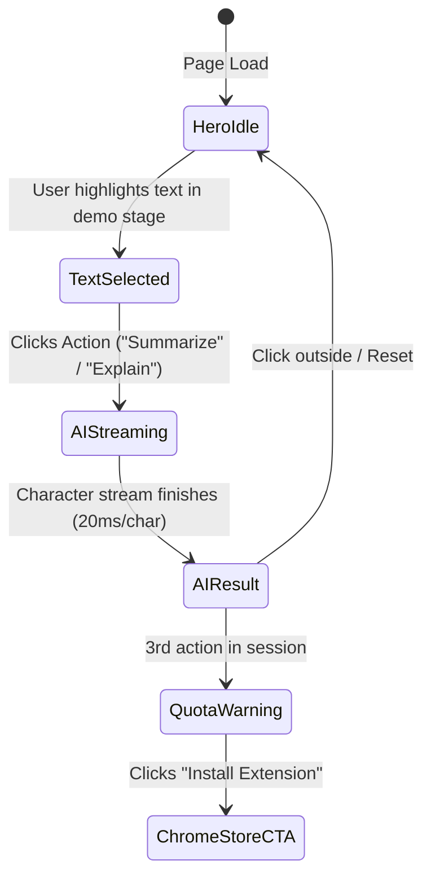

## 1. Overview
The **AI Clipboard Landing Page** uses a **Product-First Stage** pattern: rather than talking about instant contextual AI in generic marketing terms, the entire hero is a working interactive stage. Visitors experience the core micro-interaction (text selection → instant popover → streaming markdown synthesis) right inside the viewport on desktop and mobile.

- **Aesthetic**: Warm editorial minimalism (warm-white paper base, stark ink typography, precise cobalt-blue interactive accents, subtle hairline structural borders).
- **Rhythm**: Generous macro-spacing (`120px–160px` between sections) paired with tight, high-density component cards.
- **Anti-Slop Directives**: No floating 3D spheres, no neon gradients, no generic stock cards, no fake testimonial avatars.

---

## 2. UX Flow & Information Architecture

### Primary Information Architecture
1. **Minimal Navbar**: Brand mark, "How it Works", "Privacy", "FAQ", and primary CTA button ("Add to Chrome — Free").
2. **Interactive Stage Hero**:
   - Headline & punchy editorial subhead.
   - Interactive Article Canvas with sample excerpt + visual selection prompt.
   - Live Popover Component rendering the 5-state lifecycle (`idle` → `selected` → `loading/streaming` → `success` → `quota-reached`).
   - Quick-select chip buttons for touch/mobile visitors.
3. **Typographic How-It-Works**: 3-step numbered sequence using large typographic anchors instead of generic icon boxes.
4. **Asymmetric Editorial Feature Rows**: Alternating 60/40 visual-to-copy rows showcasing real extension capabilities (Instant Selection, Side-Panel History, Privacy Architecture).
5. **Streaming Side-Panel Demo**: Interactive simulated side-panel showing persistent query history, search filter, and markdown export.
6. **Typographic Privacy Strip**: Stark, high-trust statement on zero server storage, local API key mode, and client-side execution.
7. **Hairline FAQ**: Clean accordion with single-pixel hairline dividers.
8. **Final CTA & Footer**: High-conversion install action with browser badge, version string, and policy links.

---

## 3. Colors & Tokens
- **Canvas Base (`neutral-bg`)**: `#FAFAF8` — Soft warm white resembling editorial paper.
- **Surface (`neutral-surface`)**: `#FFFFFF` — Pure white for popovers, side-panel container, and elevated cards.
- **Ink Primary (`text-ink`)**: `#1A1A1A` — High-contrast dark charcoal for all headlines and primary body text.
- **Muted Text (`text-muted`)**: `#737373` — Secondary metadata, timestamps, and captions (meets WCAG AA 4.5:1 on `#FAFAF8`).
- **Interactive Blue (`primary`)**: `#2563EB` (Blue-600) — Primary CTAs, active selection highlight, loading indicator.
- **Interactive Blue Hover (`primary-hover`)**: `#1D4ED8` (Blue-700).
- **Hairline Border (`neutral-border`)**: `#E5E5E0` — 1px crisp separation borders.

---

## 4. Typography Scale & Hierarchy
- **Display H1**: `Cabinet Grotesk` (Fontsource `@fontsource/cabinet-grotesk`; system fallbacks), `3.75rem` (60px), weight 800, tracking `-0.04em`.
- **Section H2**: `Cabinet Grotesk`, `2.25rem` (36px), weight 700, tracking `-0.03em`.
- **Feature H3**: `Cabinet Grotesk`, `1.5rem` (24px), weight 700, tracking `-0.02em`.
- **Body Large**: System Sans, `1.25rem` (20px), weight 400, line-height `1.6`.
- **Body Medium / Code**: System Sans / JetBrains Mono, `1rem` / `0.8125rem`.
- **Eyebrow Caps**: System Sans, `0.75rem` (12px), weight 600, tracking `0.08em`, uppercase.

---

## 5. Live Demo Engineering & State Machine

### Hero Interactive Stage Implementation Specs
- **Selectable Container**: `
`
- **Pre-selected Prompt**: On initial load, a subtle pulsing blue indicator points to a pre-highlighted phrase: *"Try selecting this sentence right now."*
- **Mobile / Touch Affordance**: Above the stage, render three 1-click preset pill buttons (`[Summarize this paragraph]`, `[Translate to Thai]`, `[Explain term]`) that programmatically trigger the selection state without requiring manual mobile cursor selection.

### State Machine Definition
1. **State 0 (Idle)**: Default text rendered. Floating prompt banner visible.
2. **State 1 (Selected)**: Popover anchors dynamically to `window.getSelection()` bounding rect. Renders quick action pills: `[Summarize]`, `[Explain]`, `[Action Items]`, `[Copy]`.
3. **State 2 (Streaming)**: Artificial delay (80ms TTFT) followed by character-by-character typewriter streaming at `20ms/char`. A 2px vertical blue cursor blinks at the end of the streaming text.
4. **State 3 (Success)**: Result rendered in full formatted markdown with `[Copy]`, `[Insert]`, and `[Expand Sidepanel]` buttons.
5. **State 4 (Quota / Conversion Trigger)**: After 3 demo runs in a browser session, the popover gracefully switches to: *"You've unlocked 3 demo actions. Get unlimited instant popovers in any Chrome tab."* with an instant "Add to Chrome" button.

---

## 6. Motion & Micro-Interactions
- **Popover Entrance**: Spring physics `damping: 24, stiffness: 300`, opacity `0 -> 1`, scale `0.96 -> 1.0`.
- **Streaming Text**: Smooth append without layout jitter (pre-allocated min-height container `120px`).
- **Accordion FAQ**: Height animation `duration: 200ms, ease: cubic-bezier(0.16, 1, 0.3, 1)`.
- **Reduced Motion**: If `prefers-reduced-motion: reduce` is detected, disable springs and typewriter effects; transition opacity instantly.

---

## 7. Responsive & Platform Matrix

| Section | Mobile (<640px) | Tablet (640-1024px) | Desktop (>1024px) | A11y & Touch |
| :--- | :--- | :--- | :--- | :--- |
| **Nav** | Minimal logo + compact "Install" button | Standard navbar | Full links + Chrome Web Store badge | 44px min tap target |
| **Hero Stage** | Full-width stage + 1-tap action chips | Centered stage (640px) | 880px max-width editorial paper sheet | Accessible text selection |
| **Features** | Single column stack | Single column | 60/40 asymmetric editorial rows | Semantic `<h3>` hierarchy |
| **Side Panel** | Vertical preview card | Side-by-side card | Interactive simulated split panel | Keyboard navigable items |
| **FAQ** | Full-width accordion | 720px centered container | 720px centered container | `aria-expanded` attributes |

---

## 8. Slop-Ban Guardrails
1. **NO** dark gradient background blurs or neon purple accent glows.
2. **NO** generic 3D illustrations or floating glassmorphic cubes.
3. **NO** fake testimonials with Unsplash headshots.
4. **NO** layout repetition across consecutive sections.
